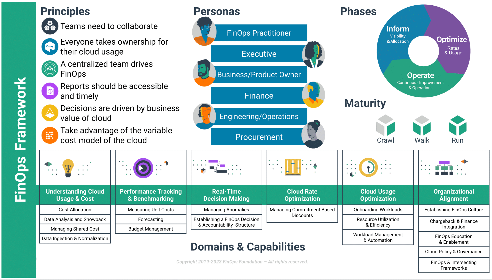

# FinOps Framework

The given framework is a mental model that is established in the industry. Visualized here:

 [source](https://www.sangfor.com/sites/default/files/inline-images/Cloud-Computing/FinOps-Poster.jpg](https://www.finops.org/wp-content/uploads/2023/02/finops-framework-image_overview.png)

## Simplified Domain Responsibility Statements

* `Understanding Cloud Usage & Cost`: Drive accountability and transparency
* `Performance Tracking and Benchmarking`: Defines what "good" looks like
* `Real-time Decision Making`: Enables a fast feedback loop for data-driven decisions on spend
* `Cloud Usage Optimization`: Ensure efficient use of resources, while reducing waste
* `Cloud Rate Optimization`: Use the various commitment-based discount programs to reduce the amount you pay for consumed resources
* `Organizational Alignment`: Align your cloud usage with your org goals and structure

It's almost like:

* Monitor
* Interpreter, Historizer
* Incident Handling, Feedback
* Usage Optimizer
* Rate Optimizer
* Org Aligner

## Domain Structure

* Definition: high-level activities that are meant to achieve an outcome, aka "Why & How"
* Capabilities: what you need to have a functioning domain
  * Definition: scope and aim of the capability
  * Maturity Assessment: gives examples of the capability at various stages of FinOps maturity
  * Assessment Lenses (I'd call it "Dimensions")
    * Knowledge: level of expertise of the domain members
    * Process: how formalized is this?
    * Metrics: is the capability measured? Can we prove progress? (Examples: Cost allocation, Forecasting Variance)
    * Adoption: How broadly is the capability adopted and accepted?
    * Automation: is the target grouo automating the capability achieving repeatability, consistency, efficiency?
* Vendors/Service Providers: a list of tools helping the domain
* Trainings, Courses: how to build the capabilities
