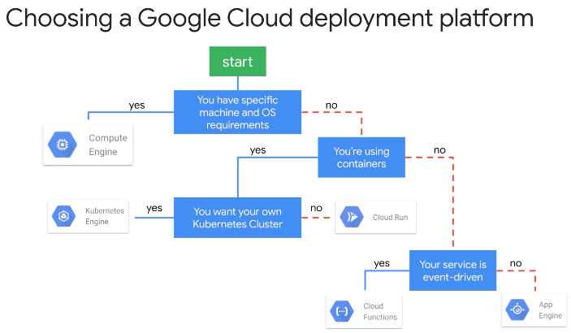
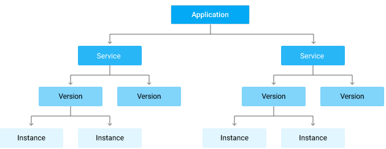

# GCP as a Application Platform

There are a number of options to run an application on GCP.

## VM based (Cloud Compute)

You run your own VM, the rest is up to you. It's possible to specify a VM to run a specific container from the container registry but I'm not aware of means to update that container without re-creating the VM.

## Containerized Application

### GKE a.k.a. Run your own K8S cluster

You're the admin of a GKE cluster. You decide the region, number of nodes and so on.

### Cloud Run (It's like helm)

This option allows you to run a given container image (it must be present in GCP Container Registry!) in a managed GKE cluster or even one of the GKE clusters that the org owns. So almost like GKE, but no administrative worries.

> The application must be stateless!

You pick a region for your image. You decide on elasticity by selected a runtime environment, amount of RAM, max burst amount of instances and so on. Once the container deployed, it is available under a URL like <https://hello-cloud-run-oxxok2hixa-uc.a.run.app>.

A CD pipeline can be setup as well but binding a Cloud Build setup to the Cloud Run setup. This will build containers from a source repository, adding them to the GCR - the container registry.

## Non-Containerized Application

### Cloud Functions (Event Driven!)

Functions are exactly like Lambda. Inexpensive (pay my 100ms of runtime), short lived and event driven. The following events are supported:
* Pub/Sub
* web requests
* changes in a storage bucket

TODO:
* What is your deliverable? 
* How to update it?
* scalability limits

### App Engine

This is a bit weird: each GCP project can contain a single App Engine application. 

An application is a logical frame around a number of services (concrete applications in a supported language like Java, Go, Node, PHP, Py, Ruby), allowing those services to talk to each other. A service can exist in multiple versions and at the version level, the service instance is available.

You start with a given application and add a `app.yaml` file with metadata to it, helping App Engine to understand it.

Service delivery can be done with `gcloud app deploy --version=one --quiet`. Once deployed, it is available under this URL scheme: `https://VERSION-dot-SERVICE-dot-PROJECT_ID.REGION_ID.r.appspot.com`. (Note: region_id is not same as region name. `uc` is for example the id for `us-central`).

Scaling is described as "automated".
