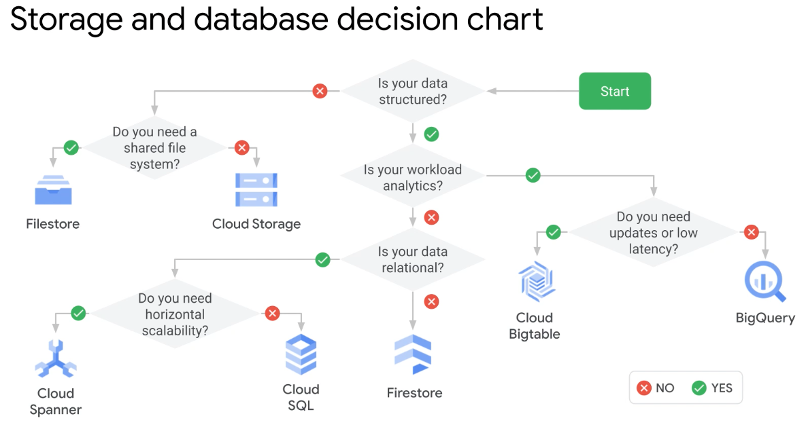

# GCP Storage Options

## Catalog Tree

* Object Store (binary and object data)
  * `Cloud Storage`
* File Storage (NAS)
  * Filestore
* Relational
  * Cloud SQL; flavors are MSSQL, Postgres, MySQL
  * Cloud Spanner; hybrid of transactional and analytical db
* NoSQL / Nonrelational
  * Firestore; hierarchical, mobile, web
  * Cloud BigTable; heavy read and write, events
* OLAP
  * BigQuery

