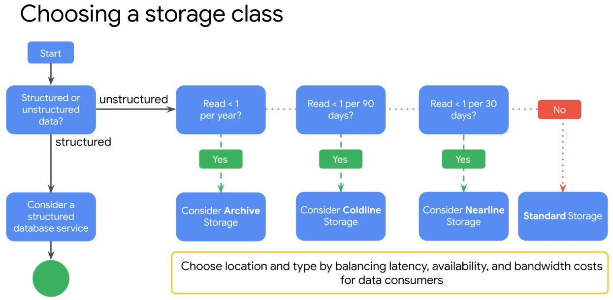

# GCP Storage Options

## Catalog Tree

* Object Store (binary and object data)
  * `Cloud Storage`
* File Storage (NAS)
  * `Filestore`
* Relational
  * `Cloud SQL`; flavors are MSSQL, Postgres, MySQL
  * `Cloud Spanner`; hybrid of transactional and analytical db
* NoSQL / Nonrelational
  * `Firestore`; hierarchical, mobile, web
  * `Cloud BigTable`; heavy read and write, events
* OLAP
  * `BigQuery`

## Cloud Storage (Object Storage, S3 like)

* very fast
* scales to exabytes
* HA - depends on storage class, from 99,9% to 99,95%
* extremely durable: 99,999999999%
* no minimum size for objects and buckets; size is limited by the quota
* buckets cannot be nested and the name is _global_
* objects can move between buckets
* objects are encrypted at rest
* offers fine-grained access control to complete buckets or single objects
  * a maximum of 100 access control lists can exist per bucket
  * an ACL specifies a list of users (can be concrete users, `allUsers` or `allAuthenticatedUsers`) and the permission (`owner`, `writer`, `reader`)
  * it's possible to create "signed URLs" that are time-limited, are signed and specify allowed operations (GET, PUT, DELETE) - sort of like a URL with an embedded JWT (so it's a bearer URL)
* automated object lifecycle management
* object versioning supported and multipe versions can be retained
* strongly consistent
* buckets can be mounted into VMs
* pricing depends on the storage class and location (region)

| Storage Class | Use Case | Minimum Storage Duration | Storage Cost | Retrieval Cost |
|---	|---	|---	|---	|---	|
| Standard  | Briefly stored data; hot data | None | 0.020$+ | None |
| Nearline  | Backups, Multimedia | Storage is billed as 30d rest duration | 0.01$+/GB/Month | 0.01$/GB |
| Coldline  | Infrequently accessed data | Storage is billed as 90d rest duration | 0.004$/GB/Month | 0.02$/GB |
| Archive   | Long term storage, e.g. for audits | Storage is billed as 365d rest duration | 0.0012$/GB/Month | 0.05$/GB |

## Filestore

* Supporta NFSv3
* Scales to hundrets of TB
* used for VMs and GKE instances

## Cloud SQL (Managed Postgres, Mysql, MSSQL)

* patches are applied automatically
* users are user managed
* Availability is unclear, but documented as less than with Cloud Spanner (which is 99,999%)
* Scalability concerns:
  * vertically max 64TB of storage
  * vertically max 60.000 IOPS
  * vertically max 624GB RAM per instance
  * horizontally scalable with _read replicas_
* HA with active/passive nodes with replication being part of the write transaction; failover is managed; both instances are hidden behind a single IP
* Backup as a service
* Import/Export possible (unclear if there is tooling beyond what the products bring on their own)
* Available product versions are:
  * MySQL versions 5.6, 5.7 or 8.0
  * Postgres 9.6, 10, 11, 12, 13, 14
* MSSQL 2017 or 2019
* Connecting to it: 
  * internally against the private IP
  * externally via cloud sql proxy (SSL certificates are managed by Google)
  * or externally via a manual SSL connection (manual cert rotation) or even unencrypted
* High level of control of the hardware setup: amount of cores, amount of disk space, type of storage
  * storage can be set to auto-increasing, which is a permanent operation

