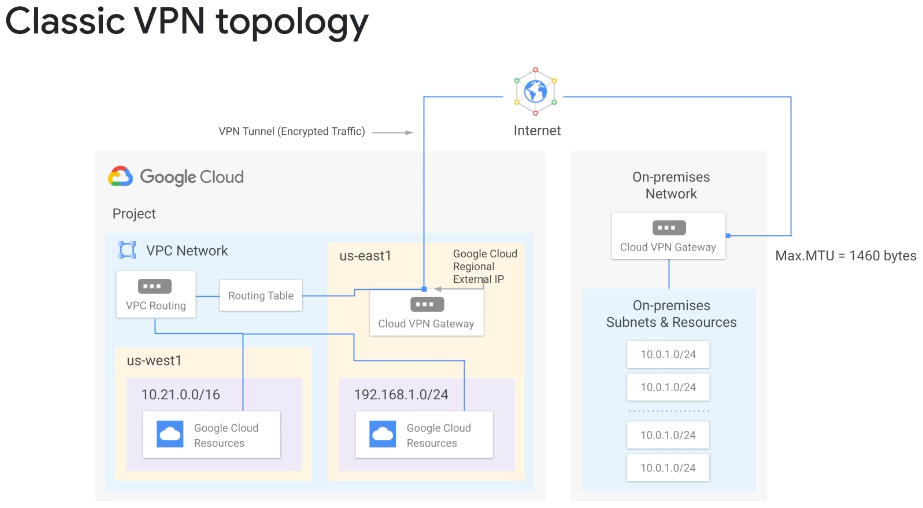

# Connecting to GCP

There are a number of options to integrate on-premise networks with the GCP infrastructure to increase bandwith between both worlds.

## Direct Peering (Layer 3)

As the name implies, you directly peer with Google at one of over 100 locations in 33 countries.
This traffic does include GCP traffic, it is however counted as egress traffic because Direct Peering exists outside of Google Cloud.

> Direct&Carrier Peering can be used by GCP, but does not require it.

Properties:

* no SLA is given
* throughput 10 Gbps
* traffic counts as egress, but at a "reduced" rate
* routes to the on-premise network do not appear in any VPC network

## Carrier Peering (Layer 3)

Again, this is primarily for customers needing access to Google Workspace (use Partner Interconnect instead otherwise). Carrier Peering exists outside of GCP, so traffic is counted as egress when leaving GCP.

Properties:
* throughput depends on the service provider
* traffic counts as egress, but at a "reduced" rate
* routes to the on-premise network do not appear in any VPC network

## Cloud VPN (Layer 3)

This provides network connectivity between:
* GCP and an on-premise network
* GCP and another cloud provider
* two GCP VPC instances

Properties:
* each tunnel supports up to 3 Gbps for the sum of ingress and egress
* can be set up as HA VPN, with 99,99% SLA

## Cloud Interconnect

This solution is meant to integrate (again) an on-premise network with a GCP VPC. It comes in 2 flavors: `Dedicated Interconnect` and `Partner Interconnect`.
This is a co-location solution and you pick the options by proximity (or lack of) to a Google datacenter, called Point of Presence (PoP).

Properties:
* bandwidth between 10 and 100 Gbps per VLAN connector
* allows access to all GCP products, but NOT Google Workspace
* traffic is not encrypted between GCP and the other network
