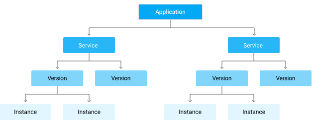

# GCP as a Application Platform

There are a number of options to run an application on GCP.

## VM based (Cloud Compute)

You run your own VM, the rest is up to you. It's possible to specify a VM to run a specific container from the container registry but I'm not aware of means to update that container without re-creating the VM.

## Containerized Application

### GKE a.k.a. Run your own K8S cluster

You're the admin of a GKE cluster. You decide the region, number of nodes and so on.

### Cloud Run (It's like helm)

This option allows you to run a given container image (it must be present in GCP Container Registry!) in a managed GKE cluster or even one of the GKE clusters that the org owns. So almost like GKE, but no administrative worries.

> The application must be stateless!

You pick a region for your image. You decide on elasticity by selecting a runtime environment, amount of RAM, max burst amount of instances and so on. Once the container deployed, it is available under a URL like <https://hello-cloud-run-oxxok2hixa-uc.a.run.app>.

A CD pipeline can be setup as well by binding a Cloud Build setup to the Cloud Run setup. This will build containers from a source repository, adding them to the GCR - the container registry.

## Non-Containerized Application

### Cloud Functions (Event Driven!)

Functions are exactly like Lambda. Inexpensive (pay by 100ms of runtime), short lived and event driven. The following events are supported:
* Pub/Sub
* web requests
* changes in a storage bucket

TODO:
* What is your deliverable? 
* How to update it?
* scalability limits

### App Engine

Each GCP project can contain a __single__ App Engine application. An application can consist of multiple different services though. A service can exist in multiple versions and at the version level, the service instance is available.

#### Flavors: Standard vs Flexible

App Engine comes in flavors `App Engine Standard Environment` and `App Engine Flexible Environment`. This applies at the service level, so you can use both flavors in the same App Engine project.

Standard:
* runs in a sandbox
* you can do lift&shift by adding an `app.yaml` file with metadata to it
* very fast deployment
* the service needs to be highly elastic
* the service is written in a supported framework and version (e.g. Java 8, 11, 17; Go 1.11 etc)
* scales to zero if there is no traffic
* price based on instance hours

Flexible:
* runs a Docker container on a opaque Compute Engine VM (which is restarted weekly!)
* deployments take longer as they go through Cloud Build
* has a consistent traffic flow and/or is fine with slow elasticity
* can be any kind of framework, even native code
* the service requires access to services or resources in a Compute Engine network 
* minimum of 1 instance
* price based on vCPU, memory and persistent disk claim

#### Deploying App Engine Versions
Service delivery can be done with `gcloud app deploy --version=one --quiet`. Once deployed, it is available under this URL scheme: `https://VERSION-dot-SERVICE-dot-PROJECT_ID.REGION_ID.r.appspot.com`. 

Note: region_id is not same as region name. `uc` is for example the id for `us-central`.
