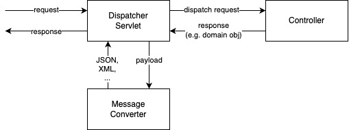

# Web Applications with Spring MVC and RESTful Applications

Spring MVC is a web framework following the MVC pattern. This can serve server side web rendering and REST. Spring Boot helps as usual with autoconfiguration.
This comes in 2 flavors (we concentrate on 1st):

1. classic Web Servlets based on Java EE Servlets with filters and listeners
2. newer Web Reactive (Webflux): non-blocking, efficient

The deliverable of such a project is either a Far JAR, which comes with a bundled web container (Tomcat, Netty, Undertow) or a WAR file that can be deployed to an external Servlet container. The embedded approach is more wide spread these days.

It all starts with the starter dependency, which transitively brings `-web`, `-webmvc`, `spring-boot-starter`, `jackson`, `tomcat-embedded` and more:

```xml
<dependency> 
  <groupId>org.springframework.boot</groupId>
  <artifactId>spring-boot-starter-web</artifactId>
</dependency>
```

## Creating a Simple Controller

A Controller is called from a Dispatcher Servlet, which takes care of message conversion in- and outbound. Message converters are auto-configured if they are found on the classpath (Jackson for JSON/XML, JAXB for XML, GSON for JSON, ..).



A controller is a POJO, annotated with the stereotype `@Controller`. You annotate handler methods with `@GetMapping`, `@PostMapping` and so on to have the Dispatcher Servlet call them.

```java
@Controller
public class AccountController

  // @ResponseBody marks the response as a REST response.
  // This disables the View handling subsystem (you don't get a HTML page there).
  @GetMapping("/accounts")
  public @ResponseBody List<Account> list() {..}
```

As a convenience annotation, `@RestController` exists. It marks all responses in a class as `@ResponseBody`:

```java
@RestController
public class AccountController {
  @GetMapping("/accounts")
  public List<Account> list() {..}
}
```

### Accessing the Request Body, Headers and other Parameters

Spring Web makes it very easy to get any kind of element of a request by simply mentioning them in the parameter of the method:

* `Principal` is the user
* `@RequestParam("accountId") int accountId` for query params: <http://host/account?accountId=1234>
* `HttpServletRequest` to get the whole request (this makes testing harder b/c you have to mock this type)
* `HttpSession` for what exactly?
* `Locale` for the locale
* `@RequestHeader("Authorization")` for header values
* ...

Example for <http://host/account?accountId=1234>:
```java
@GetMapping("/account")
public Account find(@RequestParam("accountId") long accountId) { .. }
```

With URL templating, you can access random path elements. Use `{bla}` placeholders and access them with `@PathVariable("bla")`.

Example for <http://host/account/1234>
```java
@GetMapping("/accounts/{accountId}")
public Account find(@PathVariable("accountId") long accountId) { .. }
```

> For `@RequestParam` and `@PathVariable` you can omit an explicit name if the parameter name matches the method parameter name

### A Complex Example
```java
@GetMapping("/orders/{orderId}/items/{itemId}")
public OrderItem item(
  @PathVariable long orderId,
  @PathVariable long itemId,
  @RequestParam(required=false) Boolean onlyIfAvailable, // null if not specified
  Locale locale,
  Principal user) {
  // ..
}
```

## Message Converters

If you take in a request, the caller provides an `Accept: mimetype` header to indicate the acceptable format. In the response, the host indicates the delivered format with `Content-Type: mimetype`. This is called "Content Negotiation" and this should not have an impact on the controller logic.
Message Converts (auto-configured by Spring Boot) take care of mapping the domain objects to these formats so that the developer does not have to do this programmatically.

If you want full control over the response and skip implicit handling, use `ResponseEntity` with its fluent API:

```java
// with String response
ResponseEntity<String> response = ResponseEntity.ok().contentType(MediaType.TEXT_PLAIN).body("Hello!");

// or with domain object response
ResponseEntity<Account> response = ResponseEntity.ok().lastModified(order.lastModified()).body(accountObject);
```

## WAR or JAR?

If you want a Fat Jar, you need to decide which Servlet Container to use. By default, it'll be Tomcat. This is how you change it;

```xml
<dependency>
  <groupId>org.springframework.boot</groupId>
  <artifactId>spring-boot-starter-web</artifactId>
  <exclusions>
    <exclusion>
      <groupId>org.springframework.boot</groupId>
      <artifactId>spring-boot-starter-tomcat</artifactId>
    </exclusion>
  </exclusions>
</dependency>
<dependency>
  <groupId>org.springframework.boot</groupId>
  <artifactId>spring-boot-starter-jetty</artifactId>
</dependency>
```

If you want to deploy a WAR file or even have the flexibility to do both. Remember to specify the output format in `pom.xml`:

```java
@SpringBootApplication
public class MyApp extends SpringBootServletInitializer {

  // entry point for WAR deployments
  protected SpringApplicationBuilder configure(SpringApplicationBuilder app) {
    return app.sources(MyApp.class);
  }

  // for CLI execution in a fat jar
  public static void main(String[] args) {
    SpringApplication.run(Application.class, args);
  }
}
```

## Spring Boot Developer Tools

Developing web apps requires frequent restarts to verify things. To make this easier on the dev, dev tools exists. They cause automatic restarts whenever a class changes (avoiding cold starts). It is automatically disabled when the apps considers itself running in production.

```xml
<dependency>
  <groupId>org.springframework.boot</groupId>
  <artifactId>spring-boot-devtools</artifactId>
  <scope>runtime</scope>
  <optional>true</optional> <!-- prevents it from being transitively applied to other odules in the project -->
</dependency>
```

----

## Putting it all Together

`pom.xml`:

```xml
<parent>
  <groupId>org.springframework.boot</groupId>
  <artifactId>spring-boot-starter-parent</artifactId>
  <version>2.7.5</version>
</parent>
<dependencies>
  <dependency>
    <groupId>org.springframework.boot</groupId>
    <artifactId>spring-boot-starter-web</artifactId>
  </dependency>
</dependencies>
<build>
  <plugins>
    <plugin>
      <groupId>org.springframework.boot</groupId>
      <artifactId>spring-boot-maven-plugin</artifactId>
    </plugin>
  </plugins>
</build>
```

`RewardController.java`:

```java
@RestController
public class RewardController {
  private RewardLookupService lookupService;

  public RewardController(RewardLookupService lookupService) {
    this.lookupService = lookupService;
  }

  @GetMapping("/rewards/{id})
  public Reward show(@PathVariable("id") long id) {
    return lookupService.lookupReward(id);
  }
}
```

`Application.java`. If the controller is in the same or sub-package, component scan will find it:

```java
@SpringBootApplication
public class Application {
  public static void main(String[] args) {
    SpringApplication.run(Application.class, args);
  }
}
```

`appliation.yaml` (not required, but helpful to see):
```yaml
server:
  port: 8088 # make it not use default 8080
  servlet:
    session:
      timeout: 5m
```

Running it:
```bash
mvn package
java -jar helloApp-0.0.1-SNAPSHOT.jar
curl -X GET -H 'Accept: application/json' 'http://localhost:8088/rewards/1'
```


