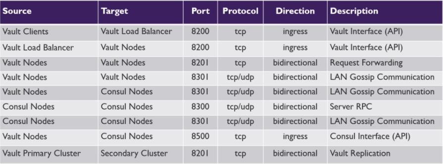

# Vault

Is a Hashicorp tool that offers management of certificates and secrets. The main selling point is the creation of dynamic secrets. Depending on how far you want to take this, dynamic secrets _can_ be:

* as short lived as you can get away with
* tailored to the needs of a particular client 
* created on demand

Compare this to the classic approach of having static credentials, shared between multiple parties, stored in a variety of places. This is far from optimal:

1. You can't easily rotate those secrets
  1. it not always clear who uses the secret and could cause an outage
  2. you need to update the credential in many places
  3. automated credential rotation is usally an afterthought and manual rotation is a common approach, requiring a specialist that is not available at night during an incident
2. secrets can easily leak due to large attack surface:
  1. it's many services
  2. possibly many data/configuration sources

### Different Distributions / Flavors of Vault
 comes in 3 flavors:

* open source: self hosted, free, dynamic secrets, ACL, key rolling, encryption as a service, aws/azure/gcp auto unseal, local clustering in a single DC (here I'm not sure why this cannot span different DCs)
* enterprise: self hosted, non-free, all of open source plus disaster recovery, namespaces, replication (aka multi-cluster setups), read-only nodes, HSM auto-unseal, MFA, Sentinel, FIPS 140-2 & Seal Wrap (some gov standard)
* vault on HCP: hosted, non-free, fully managed, scalable, pay by the hour

## Interacting with Vault

Speaking in abstract, a session goes like this:

* a client authenticates (__see auth methods__), creating an access token (__see tokens__)
* uses that token to perform operations on engines (__see Engines__) that are available behind paths; auth state and engine state is stored in the backend (__see Backend__)

To make it easy to try things out, you can run Vault in dev mode (__see Run Modes__).

### Auth Methods: Different Ways of Authenticating to Get a Token

Vault supports different means of authentication to then allow access to the secrets, engines and so on. Auth methods are optimized for different human or system to system use cases. The purpose of each auth method is to ultimately give you a token. With the token you perform your actions using any of the interfaces, be it CLI, Web or API.

Initially, the only method is the "token method", which simply expects a token being given (e.g. the `root token` that will be pre-generated for you when starting the server in dev mode).

Each auth method is enabled under a customizable path. `vault auth list` prints all enabled auth methods and their paths.

Some available auth methods:

* `userpass`: user/password manually set up
* `okta`, `github`: human-based, centralized OAuth providers
* tls certificates, k8s, azure, kerberos, `approle` and others are means for S2S authentication

#### Entities and Aliases

An entity is something that authenticats with Vault, could be a system or a person. Each entity has 0+ aliases. An alias links an entity to an auth method (e.g. entity "Jane" has alias `jsmith` with auth method `userpass` and `funky22` with auth method `github`). 

Entities and Aliases come with a bunch of metadata and 1+ policies. The policies of each can differ - the token generated when logging in will contain the policies from the entity plus the one from the alias.

It's a bit counterintuitive that the method of authentication brings different permissions, but this is how it works according to [this](https://www.udemy.com/course/hashicorp-vault/learn/lecture/27039872#overview). Example:

1. Entity `jane` has policy `management`.
2. Alias for `github` has policy `HR`.
3. Alias for `userpass` has policy `finance`.

When logging in via github, Jane will receive a token with policies `management` and `HR`. When logging in via `userpass`, it's `management` plus `finance`.

#### Vault Groups

You can group entities into Vault Groups. A group comes with a policy. When logging in an entity in a group, you receive a token with 3 policies attached to it: group, entity and alias.

Some auth methods come with external groups, like scopes in JWT or groups in LDAP. You can map those external groups in Vault to internal groups or policy names.

#### Policies: Defining What a Token Can Do

By default, you have access to nothing. Only by being associated with a policy, you get access.
Policies are cumulative, meaning that you can be subject to multiple policies and you will have access to the superset of all permissions.

Initially, there are 2 policies: `root` and `default`. The first one is added to all root tokens, the second to non-root tokens. Both policies cannot be deleted and only `default` can be changed. `default` provides "common permissions".

A policy covers paths and defines the allowed verbs on that path (`read`, `create`, `update`, `delete`, `list`, `sudo` and `deny`). For example, run `vault policy read default` to see what the `default` policy allows. Each policy is described in HCL, e.g.:

```
path "kv/database/nonprod" {
	capabilities = ["read"]
}

path "sys/policies/*" {
	capabilities = ["create", "list", "delete"]
}
```

Some paths cover administrative functions, e.g. `sys/seal` to seal the vault instance. These special paths require `sudo` capability.

##### Test Driving Policies

Let's say you created a policy and want to try out whether it works: `vault token create -policy="newpolicyname"` will give you a token with that ability.

Next, simply try a few things out that the token is supposed to support. Read a path, write to it and so on. This can be done on a dev server instance.

##### `*` Wildscards in Paths

Policies can contain wildcards in paths (see example above). A wildcard is only allowed at the end of a path. A wildcard matches paths of any depth.

Example: `secret/app/f*` matches:

* `secret/app/foo`
* `secret/app/foo/bar/baz`
* but not `secret/app`

##### `+` Wildcards in Paths

A `+` in a patch supports wildcard matching for a single directory in the path. 

Example: `secret/+/+/db` matches:

* `secret/app/nonprod/db`
* `secret/app/prod/db`
* but not `secret/prod/db
* and not `secret/app/prod`

##### Templating

There is variable replacement in some policy strings with values available to the token.
Here is an example for a generic policy statement that can apply to many users sharing a policy. It allows every user to list and create and read data under `secret/data/USERNAME/*`:

```
path "secret/data/{{identity.entity.name}}/*" {
	capabilities = ["list", "create", "read"]
}
```

The list of variables isn't long, here's a few examples:

* `identity.entity.id` entity id
* `identity.entity.name` entity name
* `identity.entity.metadata.$METADATAKEY` Metadata associated with the entity.

### Tokens

As described a token is associated with policies which describe what you are allowed to do. Token usually have a limited lifespan (TTL).

#### Roles

Instead of passing a number of parameters, one can create a role that brings a particular configuration of parameters.

Example: 

```
$ vault write auth/token/roles/stuff \
    allowed_policies="policy1, policy2, policy3" \
    orphan=true \
    period=8h
    
$ vault token create -role=stuff
# and so on
```

#### Assessing Tokens

You can check the metadata and capabilities of a token using: `vault token lookup $TOKEN`. This gives you the following properties:

* Accessor: an alias for the token (can be used for lookup, renewal, revokations, capability checks)
* TTL: a default lifespan, which might be extendable via renewals; once reached, the token is revoked
* Policies: the superset of what you can do
* Max TTL: the max lifespan; renewals in sum cannot exceed this
* Number of uses left: 0 means unlimited uses
* Renewable: whether it's renewable
* Orphaned Token: if true, parental revokation does not propagate

* check a token via it's `accessor`, which is a non-secret token alias: `vault token lookup -accessor $some-accessor`
* check what capabilities a token has at a path: `vault token capabilties $TOKEN secrts/data/prod/db`

#### Creating Child Token

Creating a child token means that you will bind them to the TTL of the current token (unless you create orphans).

* `vault token create [-policy=bla] [-period=10m]`

#### Token Hierarchy

Some token (not batch, not use-limit and maybe others) are able to create child tokens. Both can have their individual TTL, but keep in mind that when a parent token is revoked (manually or due to TTL), the child tokens are revoked too, _even if they still have TTL left_!

#### TTL

Every non-root token has a TTL and some have a maximum TTL. A token can be configured to be renewable, which means that you increase the TTL by a certain amount of time. Once maximum TTL is reached, the token is revoked disregarding the possibly remaining TTL.

* The default TTL is 768h (32 days), which can be altered in the vault configuration file like this: `default_lease_ttl = 24h`.

#### Service Tokens (Like OAuth Access Token)

Service tokens are the default kind of token. They are persisted to the storage backend. They can be renewed, revoked and you can create child tokens.

This is how you create one (`-type=service` is the default and can be left out):

```
~ # vault token create -policy=default [-type=service]
Key                  Value
---                  -----
token                s.703mZQRwzr178Oii5QjBraab
token_accessor       XAlpRAtF097z6WOLegdZGnBr
token_duration       768h
token_renewable      true
token_policies       ["default"]
identity_policies    []
policies             ["default"]
```

As you can see, service tokens start with `s.`.

#### Batch Tokens (JWT like)

Batch tokens are encrypted blobs. They are not stored to the backend and not replicated across clusters.

They are limited in their abilities: they can't be renwed, they can't be root tokens, create child tokens and a few more things.

It is possible to configure an auth method as such that it produces batch tokens by default.

The vault documentation proposes to use them when many clients (e.g. 100.000 containers) would request service tokens at once, where the backend (which _also_ syncs service tokens across clusters) would be a bottleneck. I'm getting the impression thatbatch tokens are like JWT: self contained, locally usable.

This is how you create one:

```
~ # vault token create -policy=default -type=batch
Key                  Value
---                  -----
token                b.AAAAAQLsVGFi5IrPAlUQiGOXUw6HTvFMHOxZ-HANvk-t0XvyDzTnENO5CAK9Xl7LSJC7D-VrvW3dWuTFNJrDof8XxaBVeAGGFy1u-d3H4UeX0Y4YpTKkrgebNpZaYPm17pjzGVM
token_accessor       n/a
token_duration       768h
token_renewable      false
token_policies       ["default"]
identity_policies    []
policies             ["default"]
```
As can be seen, batch tokens start with a `b.`.

## Secrets Engines in General

There are 4 categories of engines:

* Cloud Secrets Engines: AWS, Azure, GCP, GCP KMS, Alibaba
* Database Secrets Engines: Apache Cassandra, InfluxDB, MongoDB, MSSQL, MySQL, PostgreSQL, Oracle, SAP HANA and more
* Machine Level Engines: Active Directory, Consul, K/V, RabbitMQ, Nomad, SSH, TOTP and more
* Encryption Engines: Transit (hashing -, encryption/decryption - and randomness source as a service) and PKI

The full list of engines can be found [here](https://www.vaultproject.io/docs/secrets).

## Looking At a Few Engines in Detail

### Cubbyhole

> The cubbyhole secrets engine is used to store arbitrary secrets within the configured physical storage for Vault namespaced to a token. In cubbyhole, paths are scoped per token. No token can access another token's cubbyhole. When the token expires, its cubbyhole is destroyed.

> Also unlike the kv secrets engine, because the cubbyhole's lifetime is linked to that of an authentication token, there is no concept of a TTL or refresh interval for values contained in the token's cubbyhole.

> Writing to a key in the cubbyhole secrets engine will completely replace the old value.

### K/V Engine

K/V is a pure storage engine to which the user adds nodes under the root (`secret/` by default), to which one attaches k/v pair(s).

Example: 

`vault kv put secret/nonprod/database 'password=bla' 'username=dba'` results in:

```
* secret/nonprod/database // <- the node
	* password=bla
	* username=dba
```

#### KV `v1` vs `v2`: don't trip over `/data/`
Watch out: there is a v1 KV engine and a v2 KV engine. They differ insofar the v2 allows for more finegrained ACLs and it offers versioning. It is however confusing that when configuring paths for a v2, you need to remember to add a `/path` in between:

```
path "secret/data/dev/foo" {  
   // whatever
}
```
 
When accessing the path, you _omit_ mention the `/data`: `vault kv get secret/dev/foo`.

#### Best Practices

It's recommended to prepare an extendible tree structure that makes it easy to generate proper policies and is intuitive to use. Example:

* prod/
  * app1
  * app2
* nonprod/
  * app1
  * app2
* common
  * ...

Remember that there can be multiple mounted K/V stores under different paths. This will help to not have overly complicated trees.

### AWS Secrets Engine

This is a credentials "generating" engine that provides access tokens to perform actions on AWS infrastructure. When accessing this engine, it will connect to AWS and prepare a tailored "single use" user for the caller.

It supports 3 ways to generate creds:

- `iam_user` generates an IAM user with access and secret key
- `assumed_role` uses `sts:AssumeRole` to generate creds
- `federation_token` uses `sts:GetFederationToken`

#### IAM User (for Credentials For a Single AWS Account)

This engine will create users for a single AWS account. There is nothing preventing you from enabling this engines multiple times (at different paths), each aiming at different AWS accounts.

When setting this use case up, you need to:

1. Create one or more roles that define a particular IAM user and the associated IAM policy
2. Generally provide `access_key` and `secret_key` for an administrative IAM user that Vault utilizes to create the role-bound with. This administrative user needs to be allowed to also delete users so that TTL housekeeping can occur.

This is the process later on when accessing the engine:

1. a Vault client requests AWS creds.
2. Vault creates a new IAM user, attaches the configured IAM policy; for this it uses the engine's `access_key` and `secret_key`.
3. AWS returns the generated credentails to Vault.
4. Vault returns the credentials to the client with a TTL
5. the Vault client connects to AWS and does its thing
6. Once the TTL expires, Vault revokes the IAM user

#### Assume Role (for Credentials Across _Many Accounts_)

For `Assume Role`, you need to:

1. Provide `access_key` and `secret_key` with which vault as a AWS client 


This is the process later on when accessing the engine:

1. A Vault client requests AWS creds
2. Vault uses a given `access_key` and `secret_key` to connect to AWS-STS. The preconfigured IAM user has a policy that allows it only connect to AWS-STS for a particular role in that target AWS account. That target role is connected to a policy that defines what you can do. There is no additional IAM user being created here.
3. STS returns the generated credentials to Vault (Access Key, Secret Key, Session Token).
4. Vault returns the credentials to the Vault client with a TTL
5. Client then accesses AWS target account, having the target role and the associated policy. 
6. Once the TLL expires, Vault revokes the temporary credentials.


## Backends

There are many backend implementations, some community owned. They either support HA or not (see next section).

Popular backends are cloud based like S3, Consul and the internal backend, called `raft`, where each node has it's own FS based persistency, which is synced automatically.

* Consul: can be scaled independently, increasing throughput
* Raft: is a file on the FS of each Vault node (the node is stateful!), no extra network hop necessary; sync is done transparently between the nodes

### How Backends Influence Scaling

It can be run stand-alone, in clusters and with multi-cluster setup, where the clusters stay in sync.
A cluster requires a backend that supports high availability. A cluster has a leader, the rest is standby. You can also have 2 backends, one for the leader-lock (stanza `ha_storage`) and the other for the actual data (stanza `storage`).

## Clustering and Replication

In a basic configuration (using the OSS flavor), a cluster can consist of multiple nodes. There is ever only going to be a single node that processes ALL reads and writes. Increasing performance is done vertically (better hardware), not horizontally (by adding more nodes). Availability is achieved horizontally. The storage backend however must support having multiple nodes. (more here: <https://www.vaultproject.io/docs/concepts/ha>)

> Make sure to put the nodes into different AZs inside a region

There are 3 types of Vault nodes:

* the __Active Node__ is responsible for ALL reads and writes in a basic cluster configuration
* the __Standby Node__ will forward all requests to the _Active Node_ in a basic cluster configuration. Once an _Active Node_ fails, a _Standby Node_ will take over.
* the __Performance Standby__ can process read requests, but will forward writes to the active node. __Requires Enterprise License__

Having additional clusters is possible, but requires an __Enterprise License__. It can benefit overall performance and disaster recovery.

### Disaster Recovery Replication

Clustering is supposed to address high availably, meaning the ability to stay available if single nodes fail.

Disaster recovery will help with whole clusters going down, e.g. due to an AZ becoming unavaible. This is achieved with having standby clusters in other AZs or regions. This requires an __Enterprise License__.

DR replication covers this:

* K/V engine state (subject to mount filters)
* Policies
* Tokens (service tokens only)

A DR cluster does not receive client requests. Failing over to a DR cluster is done "manually" using outside tooling (load balancer).

Concrete instructions [here](https://www.udemy.com/course/hashicorp-vault/learn/lecture/17166452#overview).

### Performance Replication and Multicloud Access To Secrets

You can set up another cluster in a different cloud or different region to spread secrets and/or increase performance.

Performance replication covers:

* K/V engine state (subject to mount filters)
* Policies

A performance cluster will answer client READ requests. For this, it will provide its own tokens (and to avoid collisions, tokens from the master cluster are not synced).
WRITE requests to the secondary will be forwarded to the primary cluster.

### Channels

All communication for Vault utilizes TLS. The following ports are used:

* `tcp/8200` general API and UI port
* `tcp/8201` server to server communication
* `tcp/8500` for consul (if used) for client to server com
* `tcp/udp/8301` for consul (if used) Serf LAN for LAN gossip


([source](https://www.udemy.com/course/hashicorp-vault/learn/lecture/17166452#overview))

## Run Modes

### Dev Server

You can run Vault in dev server mode (`vault server -dev`), which runs in-memory. To access it with the CLI, run `export VAULT_ADDR='http://127.0.0.1:8200'` first, then verify with `vault secrets list`.

Dev server comes with a K/V store under `/secret` (verify this with `vault secrets list`).

### Productive Server

Usually you can use Packer to create a VM image with Vault or Terraform to setup Vault in a VM.

Running the server requires a configuration file: `vault server -config=<file>`, in a persistent VM one also needs systemd configuration.

#### Configuration with Internal Storage and no TLS (Example)

```
storage "raft" {
	path = "/opt/vault2/data1"
	node_id = "node1"
    # this is cloud based auto-join configuration
    # alternatively, one can manually join each node: `vault operator raf join http://thisnode.com:8200`
	retry_join {
	auto_join = "provider=aws region=us-east-1 tag_key=vault tag_value=us-east-1"
	}
}

# use AWS KMS to store unseal keys
seal "awskms" {
	region = "us-east-1"
	kms_key_id = "arn:aws:kms:us-east-1:826734782634:key/some-key-here"
}

listener "tcp" {
	address = "0.0.0.0:8200"
	cluster_address = "0.0.0.0:8200"
	tls_disable = 1
}

api_addr = "http://10.0.0.37:8200"
# this is only for cluster setups (which is an enterprise feature)
cluster_addr = "http://10.0.0.37:8201"
cluster_name = "vault-prod-us-east-1
ui = true
log_level = INFO"
```


