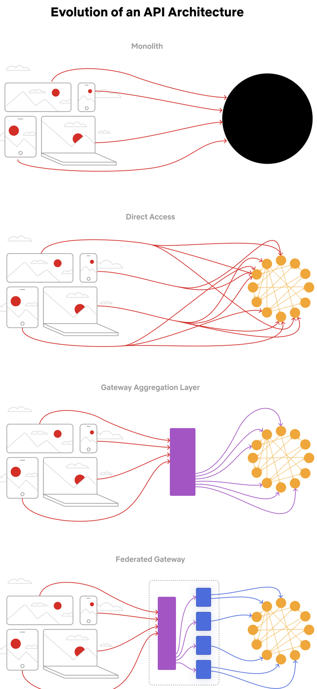

# Good API Design: Resources, Articles

## Eagerly discerning, discerningly eager

Approaches to crafting delightful, effective APIs that offer developers both convenience and stability. https://increment.com/apis/api-design-for-eager-discering-developers/

----

## “The Process: Revitalizing API development at PagerDuty”: Focusing on simplicity and empowerment proved key.

https://increment.com/apis/the-process-revitalizing-api-development-pagerduty/

They build a guild around API design with shared reviews and discussions. They had a slack channel in which you can ask for reviews of a team’s API or report bugs in some API.
Topics for the regular guild meetings were kept in Trello. Anyone can add tickets to that Trello board.

If you want to introduce a non-trivial change, explain it in a change proposal doc (https://github.com/PagerDuty-Samples/pagerduty-article-artifacts/blob/master/bwillemsen-api-change-process/TEMPLATE_new_design_doc.md). Ask for review in the guild channel and incorporate feedback. Ship it.

Pagerduty offers a public schema registry which is a simple git repo (https://github.com/PagerDuty/api-schema). It contains the API schema, glossary, a changelog document.

They have the concept of “Early Access” endpoint. As a client you must pass a “X-EARLY-ACCESS” header to be allowed to use it. EA endpoints can make breaking changes to their contract.

https://github.com/stoplightio/spectral validate and lint OpenAPI specs

----

## GraphQL vs REST API Middleware vs No BFF

REST offers resource centric APIs, GraphQL are about queries.

GraphQL is like a general purpose API gateway. Building this in REST is equally possible, but this means coming up with (client facing) Resources that the client will be interested in. These client facing resources are to be assembled by inward API calls to the dependencies.

How to deal with dependencies not being there

GraphQL: need to research this further, but it seems the way to go is to anticipate errors when coming up with the error schema (e.g. you’re interested in a user: your schema is then a union of an optional user and an optional user-fetch-error).

REST: you have an aggregate (user + address) and a part of the aggregate is not available, it would be consistent to return not just the user, but a 500. This “kills” the resource. If that resource is a content of a UI view, that view is dead.

No BFF: the frontend makes multiple requests to various backends and would have to decide itself what to do if one call fails. This is logic that you might not want to have in the UI but in the backend instead.

Further Reads

<https://netflixtechblog.com/how-netflix-scales-its-api-with-graphql-federation-part-1-ae3557c187e2>

this is the journey that Netflix took for its API. It moved away from a centrally owned API gateway (BFF, but with GraphQL) towards a model where the query component is central but the access to the single entities (order, item, vendor) is maintained by the teams.

