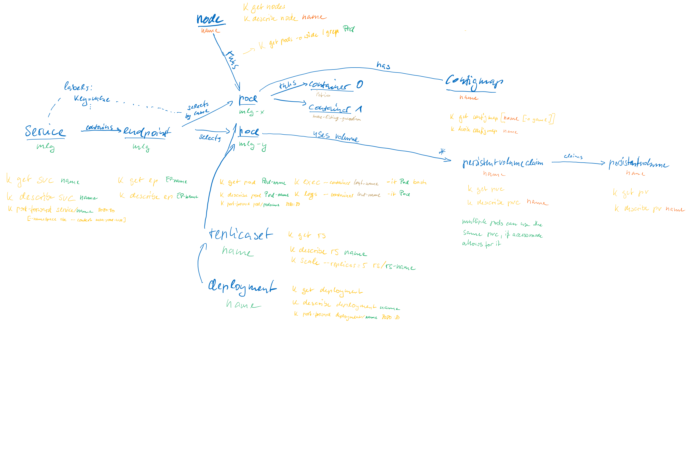

# K8S

## Resources

### po|Pod

The basic building block. Is a wrapper for one or more containers.
Will have an IP. Containers are exposed via ports on that IP.

“StaticPod” is a special kind of pod that is hardcoded right in a given node. It can be observed via the control plane (k get pods), but can’t be influenced. The control plane contains a “MirrorPod” that represents the “StaticPod”.

Interesting Properties: livenessProbe, startupProbe, readinessProbe, nodeAffinity, restartPolicy.

### rc|ReplicationController

Ensures a certain replica count of a pod that can be identified by name only. There seems to be no good reason to not use ReplicaSets instead.

### rs|ReplicaSet

Just like “rc” this controls the amount of replicas of a given pod (“I want 3 frontend pods!”). Unlike “rc”, the pods can be referenced by label, so it’s more flexible.

Specify the labels carefully! If you filter for foo=bar with replicas=2 and there are already 2 unrelated pods with those labels, the ReplicaSet is happy and does nothing.

### ds|DaemonSets

If you want a particular pod on all nodes (or a subset defined by nodeselection), this is your thing. If a new (matching) node enters the system, the pod will also be started there.
Use case could be some sort of monitoring agent, log collection etc.

### cm|ConfigMap

A key/values set of configuration values. Can be offered to a pod as ENV values or on the FS as files at a particular location.

### Secret

An object with a small amount of sensitive data (credentials, token, keys) that lives outside of an image or a pod configuration.
There are a number of different types: 
* opaque: arbitrary data; default
* basic-auth
* ssh-auth
* tls

### deploy|Deployment

Is one or more ReplicaSets plus lifecycle help around upgrade and rollbacks of container images.

Interesting properties: RollingUpgradeStrategy

Sample session:

1. `k set image deploy/my-app nginx-container=nginx:v123.456 —record`
2. `k rollout status deploy/my-app`
3. `k rollout history deploy/my-app`
4. `k rollout undo deploy/my-app`

### netpol|Networkpolicies

For a given namespace, this controls which pods can communicate with each other. Can be done on an IP level or port level.

Interesting properties:
* fromSelector: which ingress traffic is allowed
* toSelector: which egress traffic is allowed

### ep|Endpoint

An “ep” is a collection of ip:port tuples from a family of pods.

### svc|Service

Exposes pods to the outside using Endpoints. There are 4 types of services:

* clusterIp: expose application within the cluster for internal consumption (also across namespaces)
* nodePort: expose the service to the outside
* loadBalancer: expose the service to the outside, but use an external cloud load balancer as a proxy. This still creates a nodePort that the load balancer will connect to.
* externalName: like loadBalancer, but there is also a CNAME involved

### ing|Ingress

Is a proxy in front of NodePorts. It provides SSL termination, load balancing and routing path-to-service routing. There are a number of different Ingress implementations.
An Ingress can and will likely bundle different NodePort services and expose them under different FQDNs, paths etc.

### pv|PersistentVolume

A first class object describing storage in an abstract manner. The volume itself cannot be used directly: for this you need a claim.
There are different kinds of volumes (see k get storageclass): either it’s space on the node itself or some sort of cloud storage.

Properties: 
* storage class: this will decide props like allowVolumeExpansion
* size
* reclaimPolicy: how will storage reused when a PVC is deleted. Recycle|Delete|Retain. A cloud based PV with delete option would likely save costs.

### pvc|PersistentVolumeClaim

Is a request for storage by a consumer. A PVC does not directly book a certain PV, instead it defines labels that the scheduler uses to find a matching PV out of possibly many options. The scheduler might even create a PV just in time (“Dynamic PV”).

### job|Job

Like a cronjob, but meant as a one-off thing. You specify your pod and say how often it is to run ("completion: 2") and whether it can run in parallel ("parallelism: 1").

### cj|CronJob

Looks like a pod template, but with an additional "schedule" property. Executes the specifed image and that is it.

